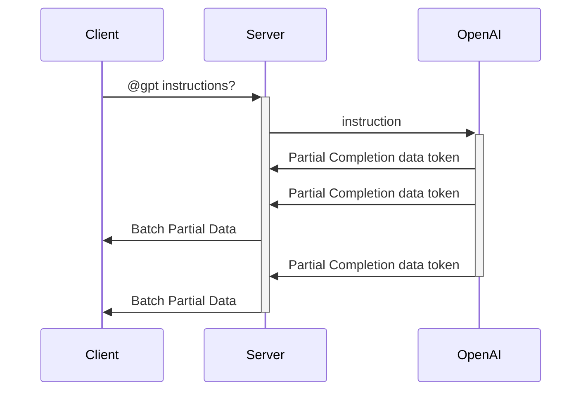

# AI Streaming with SignalR

## Introduction

In the current landscape of digital communication, AI-powered chatbots and streaming technology have become increasingly popular.
This project aims to combine these two trends into a seamless group chat application by leveraging SignalR for real-time communication and integrating ChatGPT.
This project demonstrates SignalR group chats and ChatGPT integration.

## Features

- Group Chat Functionality: Users can create or join groups and participate in a shared chat experience.
- AI Integration: Users can interact with an AI chatbot by using the @gpt command, seamlessly integrating AI responses into the group chat.
- Real-Time Streaming: The application supports real-time message streaming, ensuring that all participants receive updates instantly.

## Build and Run

### Prerequisites

- [.NET 8.0](https://dotnet.microsoft.com/download/dotnet/8.0)
- Azure OpenAI or OpenAI

### Steps

Edit `appsettings.json` and update the `Endpoint` and `Key` to be the endpoint and key of your Azure OpenAI instance. Find how to get endpoint and key [here](https://learn.microsoft.com/azure/ai-services/openai/chatgpt-quickstart?tabs=command-line%2Cpython-new&pivots=programming-language-csharp#retrieve-key-and-endpoint).
Update the `model` to your deployment name of Azure OpenAI.


Run the project with:

```bash
dotnet run
```

Open your browser and navigate to http://localhost:5000 to see the application in action.


### Use OpenAI instead of Azure OpenAI

You can also use OpenAI instead of Azure OpenAI with some minor changes.

1. Update the `appsettings.json`:

```json
"OpenAI": {
    "Endpoint": null, // Leave it null
    "key": "<key from openai>",
    "Model": "gpt-4o"
}
```

2. Update the `Program.cs`:

```csharp
builder.Services.AddSingleton<GroupAccessor>()
                .AddSingleton<GroupHistoryStore>()
//                .AddAzureOpenAI(builder.Configuration); // Comment this line and add the below line
                .AddOpenAI(builder.Configuration);
```

## How It Works

### 1. Group Chat

When a user sends a message in the chat, it is broadcast to all other members of the group using SignalR. If the message does not contain the `@gpt` prefix, it is treated as a regular message, stored in the group’s chat history, and shared with all connected users.

### 2. AI Interaction and Streaming

If a message begins with @gpt, the application interprets it as a request to involve the AI chatbot powered by OpenAI.

The application uses the streaming capabilities of OpenAI to progressively send the AI's response back to the client as it is generated. The response is buffered and sent in chunks whenever the accumulated content exceeds a specific length, making the AI interaction feel more responsive.


